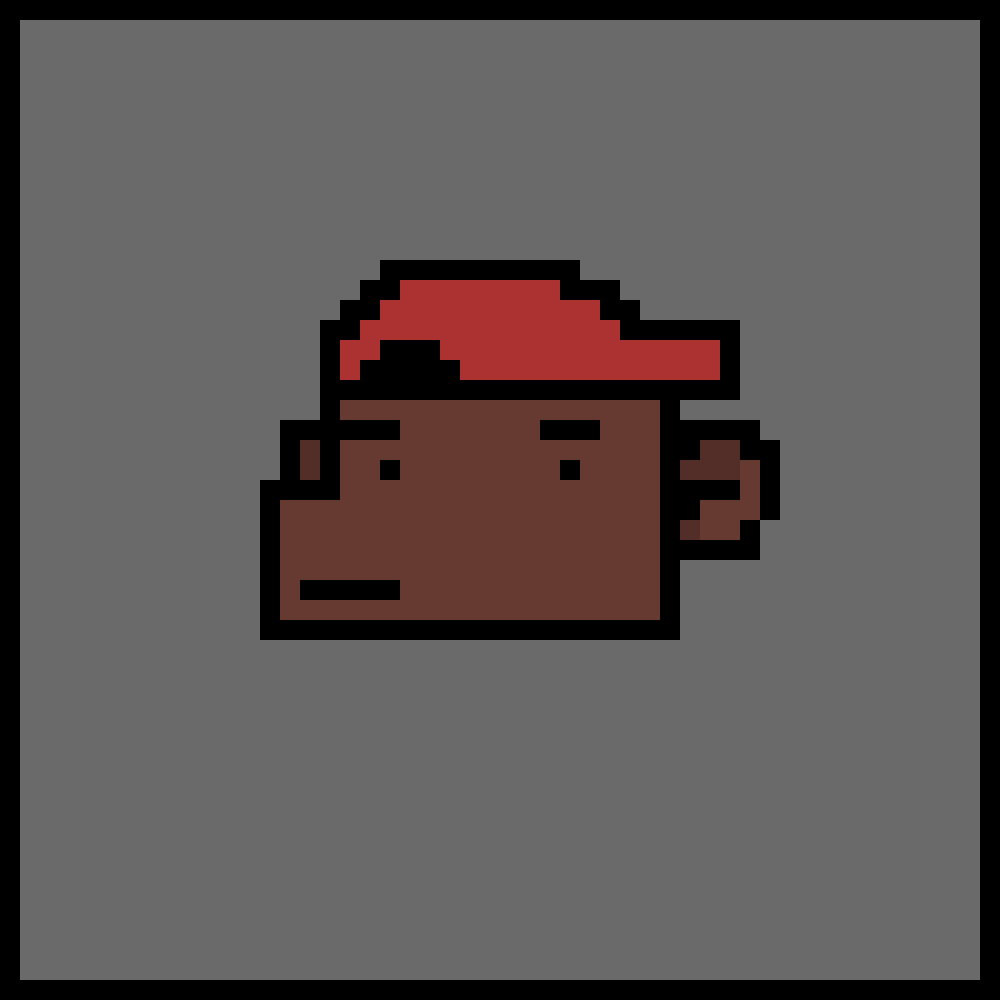

# NFTMaker 
Com o assunto cada vez mais presente em conversas e posts na internet, foi desenvolvido o NFTMaker. No jogo, o usuário pode criar sua própria variante de "NFT" e salvá-lo em sua galeria.

Utilizando duas das estruturas de dados aprendidas na disciplina (listas e dicionários), criei o aplicativo na engine Godot, com o auxílio do software Aseprite para a parte gráfica.

**⬇ Link das versões do jogo (Android/Windows):**
